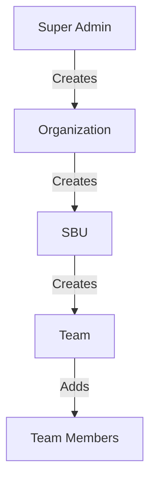
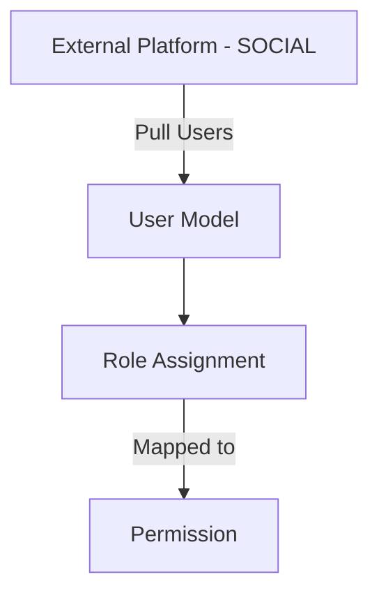

# 📝 Backend Documentation

---

## 📌 Project Overview

This backend system manages the organizational structure and role-based access control for teams, SBUs (Strategic Business Units), and organizations. The key entities include:

* **Organizations** managed by **Admins**
* **SBUs** within Organizations led by **SBU Leads**
* **Teams** within SBUs led by **Team Leads**
* **Members** under Teams
* **Users** are imported from an external system (SOCIAL) and assigned roles

All role-based permissions are defined using a flexible **Role → Permission** mapping.

---

## 🗂️ Database Schema & Entity Relationships

Here's a high-level view of the data schema and how entities are connected:

### 1. **User**

* Pulled from an external system: **SOCIAL**
* Identified by `socialId`
* Contains an array of **roles** (contextual, can be per org/sbu/team)
* Example: A user can be an `org_admin` for Org A and `team_lead` for a team in Org B

✅ Connected To:

* `Role` (via embedded `roleId`)
* Contextually linked to `Organization`, `SBU`, `Team`

---

### 2. **Role**

* Defines types of users: `superadmin`, `org_admin`, `sbu_lead`, `team_lead`, `member`

---

### 3. **Permission**

* Stores individual actions (e.g., `create_team`, `delete_sbu`)
* Combined with roles to define access rights

---

### 4. **RolePermission**

* Many-to-many link between `Role` and `Permission`
* Defines which roles can perform which actions

---

### 5. **Organization**

* Represents a company or a unit
* Created by `superadmin`
* Has a designated `adminId` (socialId of the org admin)

✅ Connected To:

* `SBU` (one-to-many)
* `Team` (indirectly, via SBUs)
* Referenced in `User` roles
* Used in access filtering

---

### 6. **SBU (Strategic Business Unit)**

* Belongs to one **Organization**
* Has one or more **SBU Leads** (`leadSocialIds`)
* Acts as a middle layer between Organizations and Teams

✅ Connected To:

* `Organization` (many SBUs per Org)
* `Team` (one-to-many)
* Referenced in `User` roles

---

### 7. **Team**

* Belongs to one **SBU** and **Organization**
* Has one **Team Lead** (`teamLeadId`)
* Contains multiple **Members** (`members` array of socialIds)

✅ Connected To:

* `SBU`
* `Organization`
* Referenced in `User` roles

---

## 🔄 Data Flow & Role Hierarchy

### ➤ **Entity Creation Flow**

### ➤ **User Role Assignment Flow**

* All users are fetched from the **SOCIAL** platform and then assigned roles within your system contextually.
* Role assignments are scoped:

  * `org_admin` → assigned at org level
  * `sbu_lead` → scoped to specific SBU
  * `team_lead` → scoped to specific Team

---

## 🔐 Role-Based Access Summary

| Role        | Can Manage           | Access Scope                            |
| ----------- | -------------------- | --------------------------------------- |
| Super Admin | Everything           | All organizations, SBUs, Teams, Members |
| Org Admin   | SBUs, Teams, Members | Specific Organization only              |
| SBU Lead    | Teams, Members       | Specific SBU only                       |
| Team Lead   | Members              | Specific Team only                      |
| Member      | View only            | Their own team                          |

---

## 🧠 Notes on Design

* **Permissions are abstracted** and not hardcoded. You can dynamically control what each role can or cannot do.
* **Users are decoupled from the system** in the sense that they come from an external source (`SOCIAL`) and only mapped in your DB through contextual roles.
* Each major entity (`Organization`, `SBU`, `Team`) is stored in its own collection with proper references to enable quick filtering and data access based on the current user’s role.
